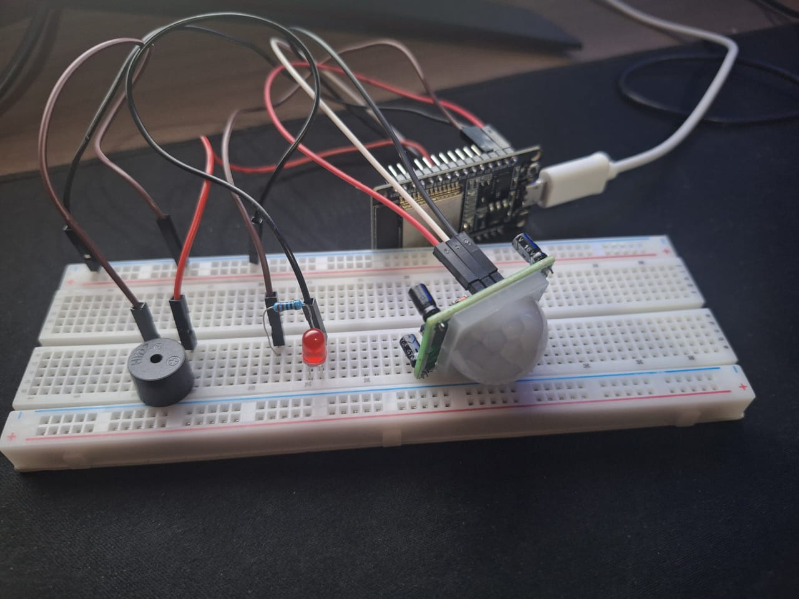

# Alarme de Movimento com ESP32

Este projeto utiliza um microcontrolador ESP32, um sensor de movimento PIR (HC-SR501) e um buzzer ativo para criar um sistema simples de alarme automático.

---

## 📦 Componentes utilizados

- Módulo de desenvolvimento ESP32  
- Sensor PIR HC-SR501  
- Buzzer ativo  
- Protoboard e jumpers

---

## ⚙️ Funcionamento

O sensor PIR detecta a presença de movimento no ambiente.  
Sempre que o movimento é identificado, o ESP32 aciona o buzzer automaticamente por 3 segundos e retorna ao estado de vigilância.

## 🖼️ Imagem do projeto

## 🧠 Aprendizados envolvidos

- Leitura de sinais digitais com ESP32  
- Controle de atuadores (buzzer) com sinal lógico  
- Lógica condicional com estruturas `if`  
- Temporização com `delay()`  
- Testes e validações práticas com sensor PIR

---

## 📘 Bibliotecas utilizadas

Nenhuma biblioteca externa necessária.

Todo o código foi implementado com funções nativas da IDE Arduino.

---

## 👨‍💻 Autor

Projeto criado por Enrike Rocha Fernandes, estudante de Engenharia de Controle e Automação.  
Foco em projetos com ESP32, sistemas embarcados e automação na prática.

